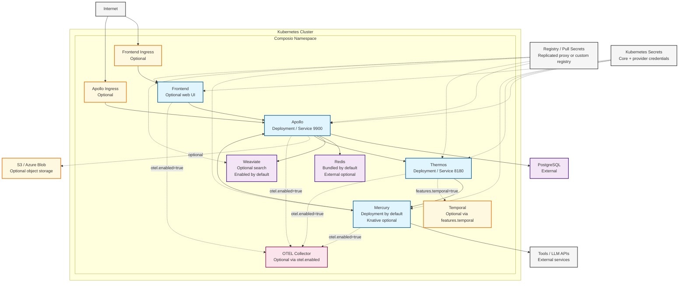

# Composio Kubernetes Architecture

This document reflects the current Helm chart defaults in [`composio/values.yaml`](../composio/values.yaml). A default release deploys Apollo, Thermos, Mercury, and bundled Redis. The chart can also deploy optional Frontend, Weaviate, ingress, Temporal, OTEL Collector, and Knative-backed Mercury; current defaults enable Weaviate.

## Architecture Overview

## Component Descriptions

### Default Workloads
- **Apollo**: Primary API service. It talks to PostgreSQL, Redis, Thermos, and Weaviate when search is enabled.
- **Thermos**: Background orchestration service. It uses Apollo and Mercury, and integrates with Temporal only when enabled.
- **Mercury**: Outbound tool execution service. The chart deploys it as a standard Kubernetes `Deployment` by default.
- **Redis**: Bundled Bitnami Redis is enabled by default. It can be replaced with `externalRedis`.

### Optional Workloads
- **Frontend**: Web UI deployment, disabled by default.
- **Weaviate**: Search/vector store wired into Apollo through `WEAVIATE_*` settings. It is enabled by default but can be disabled.
- **Apollo/Frontend Ingress**: Separate optional ingress resources for external access.
- **Temporal**: Enabled by `features.temporal`; used for auth refresh, triggers, and related workflow execution.
- **OTEL Collector**: Enabled only when `otel.enabled=true`.
- **Knative Mercury**: Enabled only when `mercury.useKnative=true`; otherwise Mercury runs as a normal deployment.

### External Dependencies
- **PostgreSQL**: External database used by Apollo and Thermos. When Temporal is enabled, the DB init job also creates Temporal databases.
- **Tools / LLM APIs**: Mercury makes outbound calls to external tool providers and model endpoints.
- **Registry / Pull Secrets**: Images are pulled either through the Replicated proxy flow or user-provided pull secrets.
- **Object Storage**: Apollo supports optional S3 or Azure Blob Storage configuration.

## Runtime Flow

1. Traffic reaches Apollo directly or through the optional Apollo ingress or Frontend path.
2. Apollo handles API and auth flows, persists data in PostgreSQL, uses Redis, and queries Weaviate for search when enabled.
3. Apollo delegates background orchestration to Thermos.
4. Thermos calls Mercury over the in-cluster service endpoint for outbound execution.
5. Mercury performs external API and tool calls and calls Apollo when needed.
6. Temporal joins the flow only when `features.temporal=true`.
7. OTEL export paths are active only when `otel.enabled=true`.
